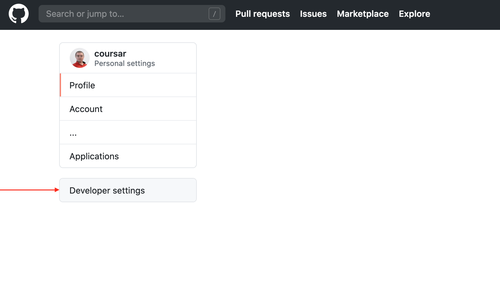
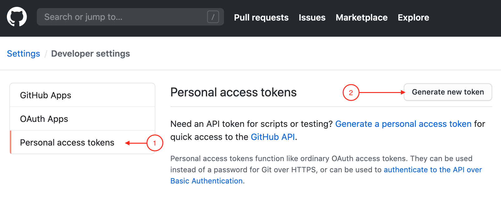
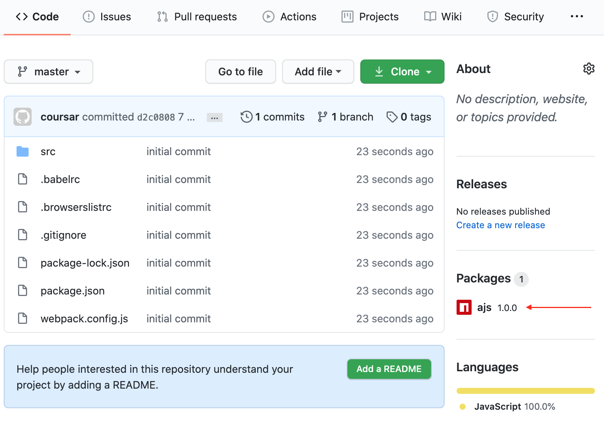

# Домашнее задание №1 к лекции «Платформы: браузер vs Node.js»

## Библиотека для браузера и Node.js

### Описание

#### Шаг 0. Создание репозитория

Перейдите на GitHub и создайте пустой репозиторий для вашего проекта (он нам понадобится для всех остальных действий). Мы будем подразумевать в рамках всей лабораторной работы, что вы назвали репозиторий `ajs`.

Склонируйте этот репозиторий на вашу локальную машину и все дальнейшие действия выполняйте в каталоге склонированного репо.

#### Шаг 1. Генерация проекта

**Важно**: везде далее под:
1. `USERNAME` будет пониматься имя вашего пользователя на GitHub в нижнем регистре (все буквы маленькие)
1. `REPO` будет пониматься название вашего репозитория на GitHub в нижнем регистре (все буквы маленькие)
1. `TOKEN` будет access token (см. ниже), который вы сгенерируете на GitHub

Создайте репозиторий на GitHub, после чего с помощью `npm init --scope=@username` (где `username` - имя вашего пользователя на GitHub в нижнем регистре, например, если на GitHub у меня логин `Netology-Code`, то команда будет `npm init --scope=@netology-code`) сгенерируйте package:
1. package name - @username/ajs (вам предложат автоматически)
1. version - 1.0.0 (по умолчанию)
1. description - оставьте пустым (по умолчанию)
1. entry point - dist/index.js (!надо поменять на dist/index.js)
1. остальное всё по умолчанию (просто нажимайте enter)

Убедитесь, что в `packages.json` автоматически прописался адрес вашего репозитория.

Добавьте `.gitignore`, который мы для вас [приготовили](../.gitignore).

Сделайте commit и push, убедитесь, что код попал в ваш репозиторий на GitHub

#### Шаг 2. Получение Access Token

Мы будем использовать сервис GitHub Packages (куда вы опубликуете свою библиотеку), чтобы не замусоривать npmjs.com.

Для этого, нам нужно получить Access Token.

Перейдите в настройки:


Выберите пункт меню Developer Settings:



Выберите пункт меню Personal Access Tokens (1), затем нажмите на кнопку Generate new token (2):



Заполните поле Note (1) и поставьте флажок напротив write:packages (2), остальные все флажки выставятся автоматически:


После чего нажмите на кнопку Generate в самом низу страницы:


GitHub запроси у вас пароль для подтверждения:


После чего вам будет сгенерирован токен. **Важно**: токен будет показан только один раз, поэтому убедитесь, что скопировали его:


Если вдруг вы всё-таки не скопировали его, то просто удалите старый и сгенерируйте новый.

#### Шаг 3. Установка зависимостей

Установите следующие dev-зависимости:

* @babel/cli
* @babel/core
* @babel/preset-env
* babel-loader
* webpack
* webpack-cli

Обратите внимание, для простоты мы не устанавливаем corejs, в случае Node.js он вообще не нужен, а в случае браузера будем считать, что это ответственность подключающего библиотеку.

#### Шаг 4. Конфигурационные файлы

.babelrc:

```
{
  "presets": [
    [
      "@babel/preset-env"
    ]
  ]
}
```

.browserslistrc:

```
last 1 version
> 1%
not dead
```

webpack.config.js:

```
const path = require('path');
module.exports = {
  entry: './src/index.js',
  output: {
    path: path.resolve(__dirname, 'dist'), // каталог для результатов сборки
    filename: 'index.js', // имя файла с результатами сборки (должно совпадать с entry point в шаге 1)
    library: 'ajs', // название нашей библиотеки
    libraryTarget: 'umd', // UMD (Universal Module Definition https://github.com/umdjs/umd) - шаблон, который позволяет использовать RequireJS и браузер
    libraryExport: 'default', // экспортируется имя default
    globalObject: 'this', // что принимать за глобальный объект, иначе сгенерируется window, а его, как вы знаете, на платформе Node.js нет
  },
  module: {
    rules: [
      {
        test: /\.js$/,
        exclude: /node_modules/,
        use: {
          loader: 'babel-loader',
        },
      },
    ],
  },
};
```

Особые настройки package.json:

```
  "publishConfig": {
    "registry":"https://npm.pkg.github.com/"
  },
  "scripts": {
    "build": "webpack --mode production"
  },
```

`publishConfig` - куда публикуем наш пакет (в GitHub Packages)

`build` - скрипт сборки

#### Шаг 5. Создание библиотеки

В файле `src/index.js` разместите следующий код:

```js
function info() {
  const m = new Map();
  m.set('name', 'ajs');
  m.set('version', '1.0.0');
  return m;
}
export default {
  info
};
```

После чего запустите сборку: `npm run build` - у вас должен появиться каталог `dist` с файлом `index.js` внутри.

Теперь добавьте всё в git и сделайте push. Удостоверьтесь, что все файлы были отправлены на GitHub.

#### Шаг 6. Создание .npmrc

Перейдите в ваш домашний каталог (узнать, где он находится, можно с помощью команды `echo $HOME` в Linux/Mac или `echo %USERPROFILE%` в Windows) и создайте там файл `.npmrc` (не забудьте про точку) следующего содержания:

```
//npm.pkg.github.com/:_authToken=TOKEN
registry=https://npm.pkg.github.com/USERNAME
```

Обратите внимание, вместо `TOKEN` вы подставляете токен, вместо `USERNAME` - имя своего пользователя в нижнем регистре.

Q: что это нам даёт?

A: NPM будет использовать эти данные для аутентификации, а с помощью GitHub Packages (запись `registry`) вы создадите собственный мини-аналог npmjs.com.

Q: почему мы сразу не публикуем на NPM?

A: чтобы не замусоривать его + из соображений безопасности, вам даётся всего 72 часа, чтобы удалить потом пакет оттуда (при условии, что никто не успел им воспользоваться). А кроме того, если вы удалите пакет, то потом уже не сможете воспользоваться этим именем (например, создадите пакет `ajs` для тестов, удалите его, а затем снова решите создать такой же - не получится). В GitHub Packages же проблем с этим не будет - можно просто удалить репо, создать новый и пробовать заново.

А теперь самое важное: опубликуем пакет.

Для этого есть команда `npm publish`. Если вы всё сделали правильно, то её вывод будет выглядеть примерно так (конечно, у вас будут другие адреса):


Обратите внимание, что `dist/index.js` есть в опубликованном пакете, но не хранится в GitHub, т.к. находится в файле `.gitignore`.

Теперь обновите страницу репозитория. Сбоку вы должны увидеть информацию о пакете:



Кликните на имени пакета, чтобы посмотреть информацию о нём:


